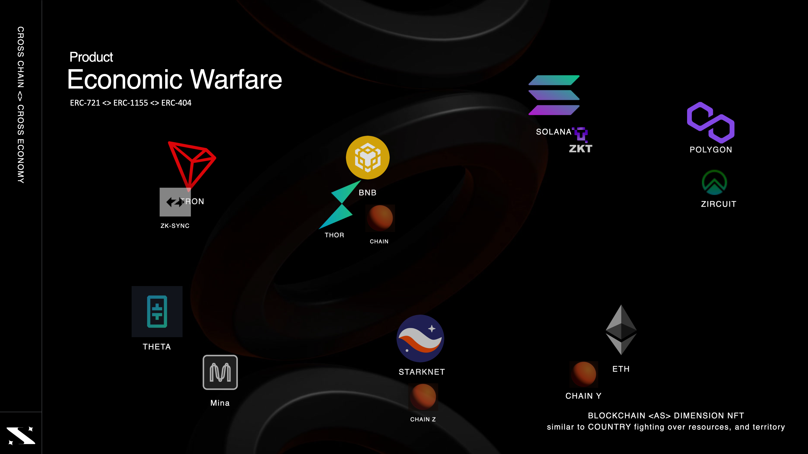
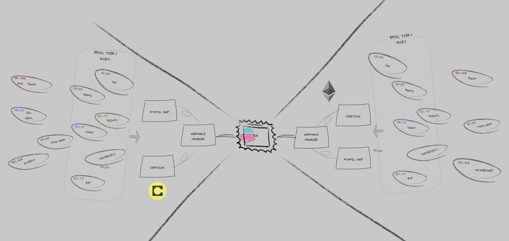
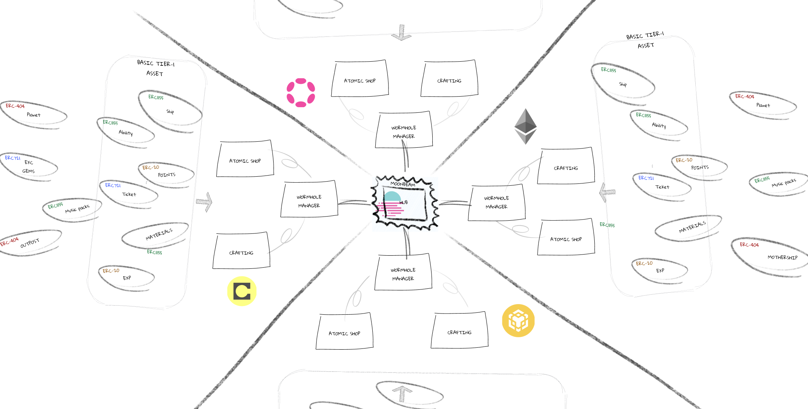
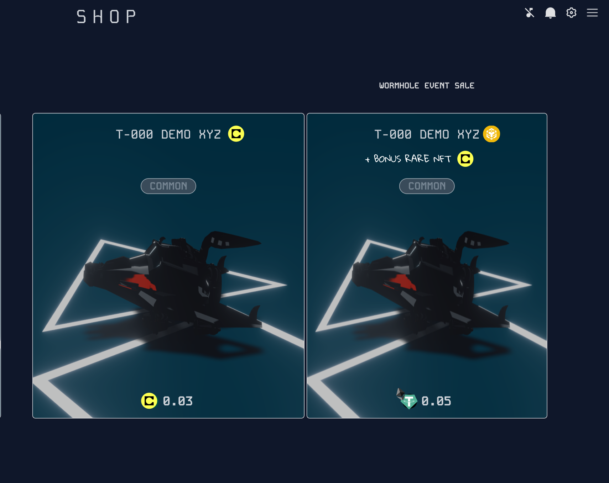
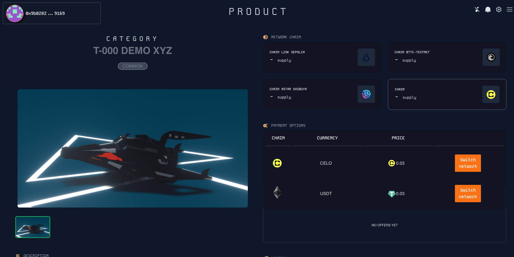
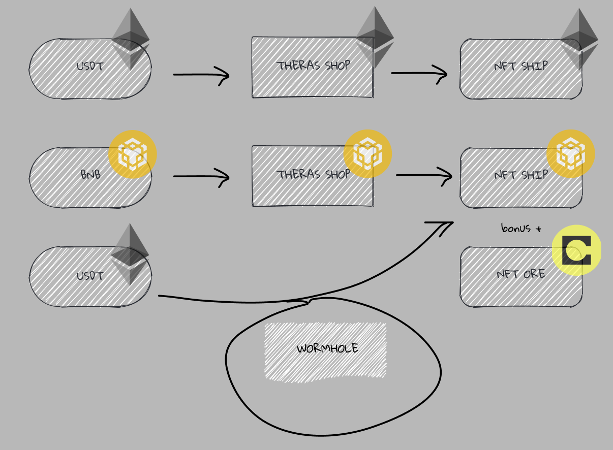
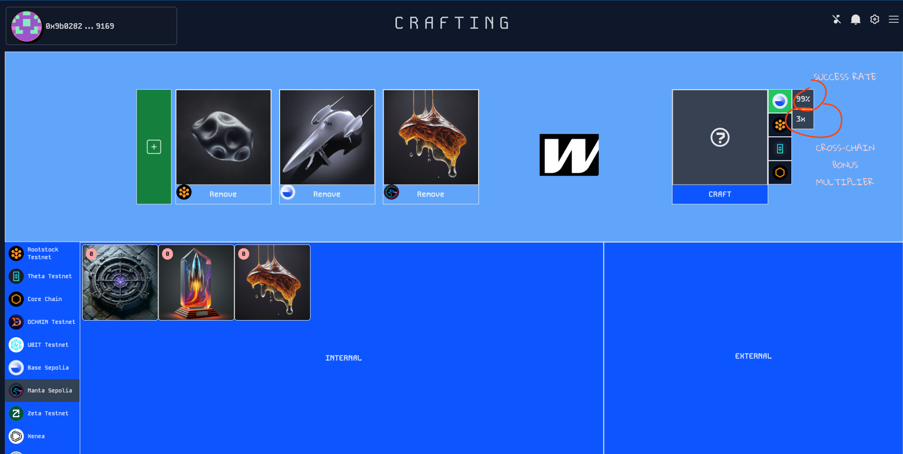
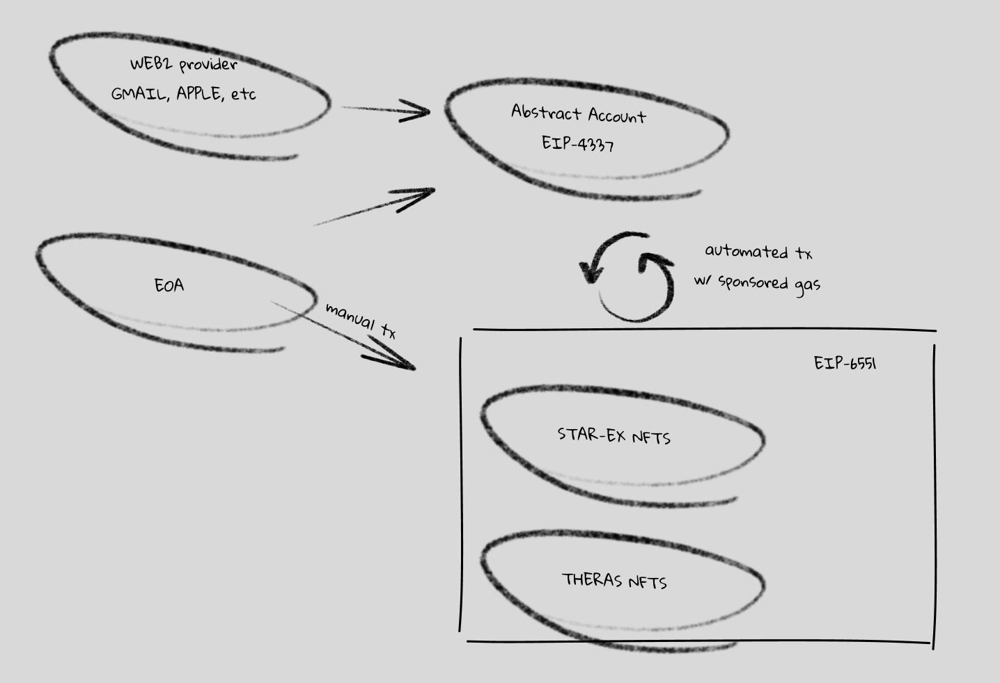

# STAR-EX Wormhole Update

Welcome to the STAR-EX Wormhole update for our smart contract. This update is part of our submission to the Wormhole Hackathon and focuses on enhancing cross-chain interactions within the STAR-EX GameFi ecosystem.

## Introduction to STAR-EX

STAR-EX is an L3 GameFi project that fosters interoperability between various blockchain networks. The goal is to create an environment where different networks collaborate and compete within the game, enriching the community interaction and experience. The game is inspired by a lore about dimension explorers, where each dimension represents a different network, akin to how countries operate in the real world.

Each network (country) has its own native currency and assets (NFTs) with supply and demand dynamics. Networks can produce these assets to advance in challenges and survive within STAR-EX, just as countries produce and utilize assets to advance their civilization and economy. Networks will compete for territories and assets, while less popular or new networks (3rd world countries) will support others, focusing on collaboration.



Everything within STAR-EX, from territories, game modes, music packs, to abilities, is represented as NFTs. Players will engage in various game zones directly through action gameplay.


Alternatively, players can engage in staking gameplay to collect NFT materials, which they can then craft into desired NFTs. These materials are sourced from various network chains, and players can engage in governance and war systems to control these resources (ERC-20, ERC-721).

## Contract Implementation

Our implementation is designed to be flexible, allowing for various conditions leveraging the payload bytes. We have written 2 main contracts on this code implementation:

- **Hub Contract**: Central contract for cross-chain interactions.
- **Wormhole Manager**: Deployed on every chain.
- **Interface for Wormhole Manager**: Supports integration with other modules like shop and crafting.



### Single Payload Structure

While we use a single payload structure to handle cross-chain transactions:

```solidity
(
    bool isArray,
    uint256 wm_receiverValue,
    uint256 wm_targetChain,
    address endManagerAddress,
    address actionAddress,
    ActionType actionType,
    TokenType tokenType,
    uint256 productId,
    uint256 quantity,
    address productAddress,
    address recipientAddress,
    uint256 timestamp
) = abi.decode(
    payload,
    (
        bool,
        uint256,
        uint256,
        address,
        address,
        ActionType,
        TokenType,
        uint256,
        uint256,
        address,
        address,
        uint256
    )
);
```

This structure can also be modified to handle multiple cross-chain interactions in a single transaction:

```js
(
    bool isArray,
    uint256[] memory wm_receiverValue,
    uint256[] memory wm_targetChain,
    address[] memory endManagerAddress,
    address[] memory actionAddress,
    uint256[] memory actionType,
    uint256[] memory tokenType,
    uint256[] memory productId,
    uint256[] memory quantity,
    address[] memory productAddress,
    address[] memory recipientAddress,
    uint256 timestamp
) = abi.decode(
    payload,
    (
        bool,
        uint256[],
        uint256[],
        address[],
        address[],
        uint256[],
        uint256[],
        uint256[],
        uint256[],
        address[],
        address[],
        uint256
    )
);

```

## Deployment Strategy

The Hub contract is deployed once in moonbeam leveraging the polkadot interaction too, while the Wormhole Manager and other contracts are deployed on each network. This approach reduces the complexity of assigning whitelists across networks by assigning them to a single source address, making it more manageable given the complexity of our cross-chain interactions.



## Deployed Contracts

- **MoonbeamAlpha Testnet**: Hub Contract: 0xd65d3146f6a46158741DB47E56da197115879938
- **CELO Testnet**:
  - Theras Shop: 0x823dA7aF4E3A0C8bcaD4462729Eb73e26dc3d45f
  - Wormhole Manager: 0xed3f3e6eBf67cf360C5EF3f650e0E69CC3a70CAb
  - Mock NFT-1155 (without Ticket system): 0xE348f87eb3fbE21F863768185347fC602B845940
- **Sepolia Testnet**:
  - Theras Shop: 0x81DD2ddE4FabB954A231B701550FcD7C35c547C6
  - Wormhole Manager: 0x54fD2625d9FC056d1331781D2f1689Ca067fAcC3
  - Mock NFT-1155: 0x33A4298cB39329115Dbe8A7acC3EE8cD1223835F
- **Fuji Testnet**:
  - Theras Shop: 0x5c347CE1CA5606d992Fb31AB529C8A3d55a6E2d4
  - Wormhole Manager: 0xC8E633D1Da2b23A12458682cB0d065A4452b6030
- Mock NFT-1155: 0x5b6288be71623E408D61D0417A51572d7CBC10e2

## Goals of the Wormhole Integration

### Cross-Chain Purchases with Dynamic Token Payment

Avoid fractional swaps/bridges by allowing users to purchase exclusive event items on unfamiliar network chains using their preferred tokens. This eliminates the need to find available liquidity on DEXs.





### Multiple Interactions in a Single Transaction

Include multiple interactions, such as airdrops, in a single transaction. For example, during network X events, every purchase or contract interaction for specific products can immediately reward the user with additional products.



### Cross-Crafting

Users can benefit from higher success rates, higher rarity, or multiple results for low-tier NFTs through cross-crafting. This feature boosts transactions on other chains and balances game resources.



## Implementations

- **Atomic Theras Shop Contracts** ✅:  
  This shop will be used in the future marketplace, mixing assets from STAR-EX, HYAPE, BUZZUP (SocialFi), hiss.gg, and more for cross-purchases with dynamic token payments.
- **Theras Shop UI** [TBC]:

- **Cross-Crafting Contract**🛠️:

- **Wormhole Bridge Contract**🛠️:  
  Will be used for the marketplace trade system as well.

- **On-Chain Gameplay**🛠️:  
  Features such as deploying minefields [Minefield](https://github.com/Theras-Labs/starex-evm-contract-v2) or a PIRATE system to steal assets (TBC).

- **Theras Auction Marketplace** (TBD)

## What's Next for the Contract

### Integration with EIP-4337 (Abstract Account), EIP-6551 (Token Bound), and EIP-7579

These integrations will automate our cross on-chain gameplay and provide direct rewards during gameplay.


**STAR-EX** is a rich world-building game that fully utilizes the Wormhole protocol to enable multi-dimension (multi-network) exploration, creating the most interesting gameplay interactions.

We also plan to publicly open our cross-crafting feature to involve other projects across chains, enabling B2B collaborations in addition to B2C interactions.

**Stay tuned for more updates!**

## Official Links and Contact

- [YouTube - Wormhole](https://www.youtube.com/watch?v=hHUdfGgEvio)
- [YouTube - Cross-Crafting](https://www.youtube.com/watch?v=9PE0CnxivsE)
- [Twitter](https://twitter.com/theras_labbs)
- [Discord](https://discord.gg/starex)
- [Telegram](https://t.me/@dellwatson)
- [Gamebook](https://gamebook.starex.app)
- [Demo Link](https://demo.starex.app)
