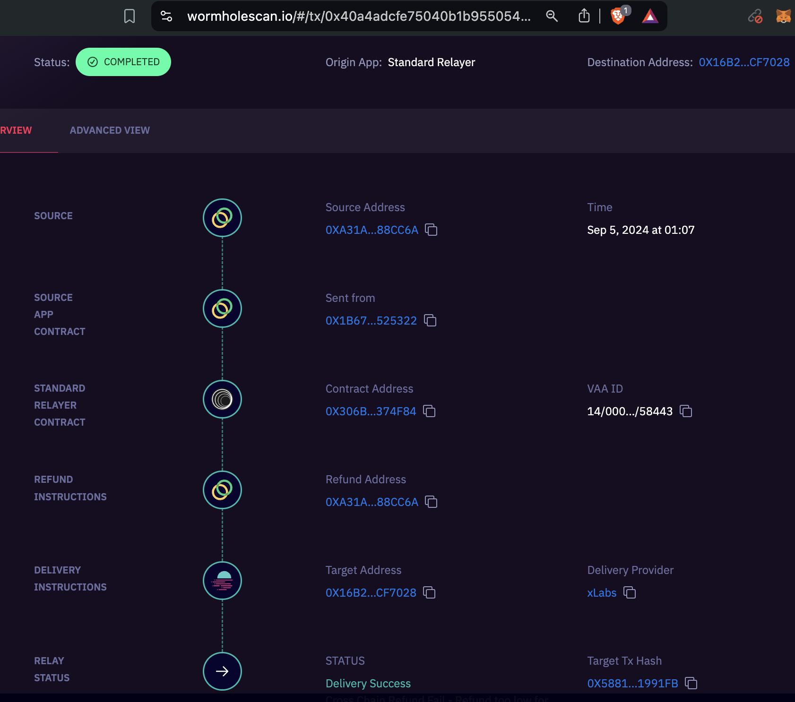
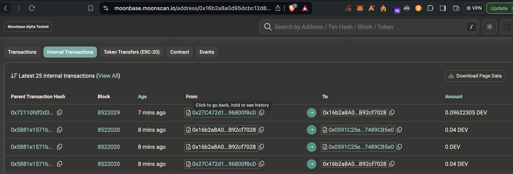
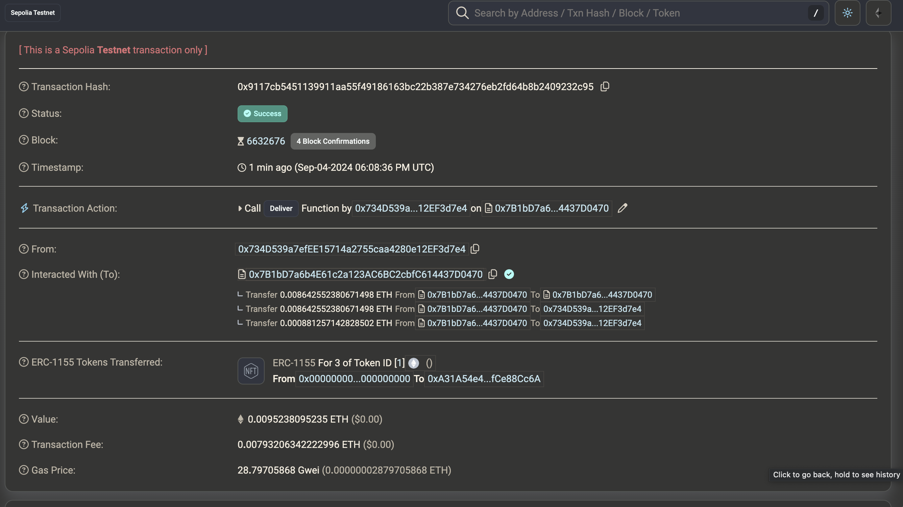
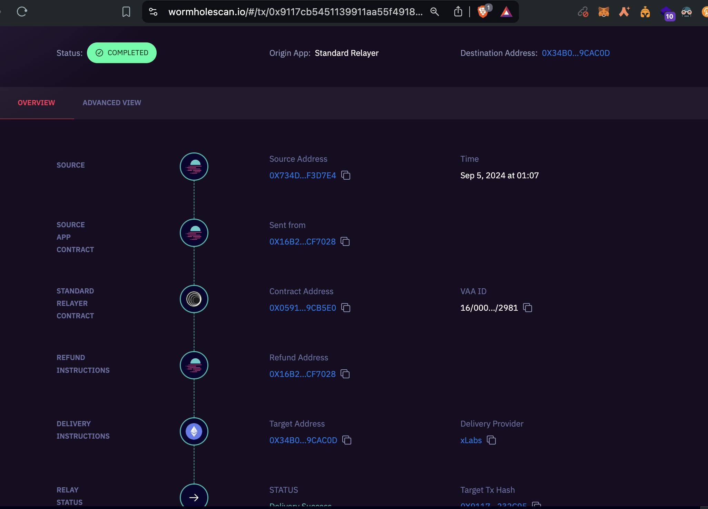

# STAR-EX Wormhole Update

Welcome to the STAR-EX Wormhole update for our smart contract. This update is part of our submission to the Wormhole Hackathon and focuses on enhancing cross-chain interactions within the STAR-EX GameFi ecosystem.

<blockquote class="twitter-tweet"><p lang="en" dir="ltr">3/ Remember how crucial <a href="https://twitter.com/hashtag/Interoperability?src=hash&amp;ref_src=twsrc%5Etfw">#Interoperability</a> is in <a href="https://twitter.com/hashtag/STAR_EX?src=hash&amp;ref_src=twsrc%5Etfw">#STAR_EX</a>, as it&#39;s a cross-chain GameFi project with big goals, involving 32+ network chains in the first-tier league, including several EVM networks and <a href="https://twitter.com/Polkadot?ref_src=twsrc%5Etfw">@Polkadot</a>. <br><br>We&#39;re now integrating <a href="https://twitter.com/wormhole?ref_src=twsrc%5Etfw">@wormhole</a> <a href="https://twitter.com/WormholeEco?ref_src=twsrc%5Etfw">@WormholeEco</a> <a href="https://twitter.com/WormholeFdn?ref_src=twsrc%5Etfw">@WormholeFdn</a> into our… <a href="https://t.co/SwqD7ppLAi">pic.twitter.com/SwqD7ppLAi</a></p>&mdash; THERAS Labs (@theras_labs) <a href="https://twitter.com/theras_labs/status/1830344688425156642?ref_src=twsrc%5Etfw">September 1, 2024</a></blockquote> <script async src="https://platform.twitter.com/widgets.js" charset="utf-8"></script>

# Layout

- Intro to STAR-EX
- Contract Implementation & Strategy
- Deployed Contracts
- Demo-UI
- Demo-TX
- Goals for integrations
- What's next
- Other Links

## Introduction to STAR-EX

STAR-EX is an L3 GameFi project that fosters interoperability between various blockchain networks. The goal is to create an environment where different networks collaborate and compete within the game, enriching the community interaction and experience. The game is inspired by a lore about dimension explorers, where each dimension represents a different network, akin to how countries operate in the real world.

Each network (country) has its own native currency and assets (NFTs) with supply and demand dynamics. Networks can produce these assets to advance in challenges and survive within STAR-EX, just as countries produce and utilize assets to advance their civilization and economy. Networks will compete for territories and assets, while less popular or new networks (3rd world countries) will support others, focusing on collaboration.


Everything within STAR-EX, from territories, game modes, music packs, to abilities, is represented as NFTs. Players will engage in various game zones directly through action gameplay.


Alternatively, players can engage in staking gameplay to collect NFT materials, which they can then craft into desired NFTs. These materials are sourced from various network chains, and players can engage in governance and war systems to control these resources (ERC-20, ERC-721).

## Contract Implementation

Our implementation is designed to be flexible, allowing for various conditions leveraging the payload bytes. We have written 2 main contracts on this code implementation:
[contract/wormhole](https://github.com/Theras-Labs/tokenised-contracts/tree/7054f514e3eb812216088fab1cf409b89995c516/contracts/wormhole)

- **Hub Contract**: Central contract for cross-chain interactions.
- **Wormhole Manager**: Deployed on every chain.
- **Interface for Wormhole Manager**: Supports integration with other modules like shop and crafting.


### Single Payload Structure

While we use a single payload structure to handle cross-chain transactions:

```solidity
(
    bool isArray,
    uint256 wm_receiverValue,
    uint256 wm_targetChain,
    address endManagerAddress,
    address actionAddress,
    ActionType actionType,
    TokenType tokenType,
    uint256 productId,
    uint256 quantity,
    address productAddress,
    address recipientAddress,
    uint256 timestamp
) = abi.decode(
    payload,
    (
        bool,
        uint256,
        uint256,
        address,
        address,
        ActionType,
        TokenType,
        uint256,
        uint256,
        address,
        address,
        uint256
    )
);
```

This structure can also be modified to handle multiple cross-chain interactions in a single transaction:

```js
(
    bool isArray,
    uint256[] memory wm_receiverValue,
    uint256[] memory wm_targetChain,
    address[] memory endManagerAddress,
    address[] memory actionAddress,
    uint256[] memory actionType,
    uint256[] memory tokenType,
    uint256[] memory productId,
    uint256[] memory quantity,
    address[] memory productAddress,
    address[] memory recipientAddress,
    uint256 timestamp
) = abi.decode(
    payload,
    (
        bool,
        uint256[],
        uint256[],
        address[],
        address[],
        uint256[],
        uint256[],
        uint256[],
        uint256[],
        address[],
        address[],
        uint256
    )
);

```

## Deployment Strategy

The Hub contract is deployed once in moonbeam leveraging the polkadot interaction too, while the Wormhole Manager and other contracts are deployed on each network. This approach reduces the complexity of assigning whitelists across networks by assigning them to a single source address, making it more manageable given the complexity of our cross-chain interactions.


## Deployed Contracts

- **MoonbeamAlpha Testnet**: Hub Contract: 0x16b2a8A0D95Dcbc12D875DA9DFD069eB92cf7028
- **CELO Testnet**:
  - Theras Shop: 0x3fEa66577Bc3fD5763b93F91aBc8739a02Fc4C81
  - Wormhole Manager: 0x1b6765a024B67D420384627645aAe57044525322
  - Mock NFT-1155 (without Ticket system): 0xE348f87eb3fbE21F863768185347fC602B845940
- **Sepolia Testnet**:
  - Theras Shop: 0x66a5d7690D8dBbD4D8DbaCb860AA335403fDB4eC
  - Wormhole Manager: 0x34B0b2B6858e68C17d790f6e9A17FE107b9cAC0d
  - Mock NFT-1155: 0x33A4298cB39329115Dbe8A7acC3EE8cD1223835F
- **~~Fuji Testnet~~**:
  - Theras Shop: 0x5c347CE1CA5606d992Fb31AB529C8A3d55a6E2d4
  - Wormhole Manager: 0xC8E633D1Da2b23A12458682cB0d065A4452b6030
- Mock NFT-1155: 0x5b6288be71623E408D61D0417A51572d7CBC10e2

really hard to get big faucet for the 4th network, only celo and moonbeam that easily provide with big faucet as I deploy a lot of contracts too. As sepolia i had my own faucet running.

## Demo UI

// demo -> it supposed to be buy 1 NFT from sepolia and get 1 from celo network too, but the sepolia to moonbeam take a decade to finish the tx. so it's from celo to moonbeam -> then rewarding the sepolia NFT.

and for now I removed the purchase fee, so it's like claim NFT from celo and get 1 from sepolia. The event can be intepreted many things, from purchase NFT SHIP in ETH network with bonus of 2 Rare Material NFTs (from celo, and from avalanche) or crafting events with rewards in NFT from other chain. Depending our strategy and situation later.


the UIUX code can be try through this [demo-site](https://demo.starex.app/shop)

PS: apparently we had major issue now, disturbing the other contract call. (Now other purchase unable to connect to rpc, most likely library problem) but I'm still unsure with the UI issue since it's already 5days finding out the bugs.

So instead, I prepared the function without restriction directly in contract for testing purpose.

```js
// Celo WM Manager address =
const tx = await CeloWM_Manager.DIRECT_TEST_forwardWormholeTask(
  false, //
  10002, // sepolia wormhole-id
  "0x34B0b2B6858e68C17d790f6e9A17FE107b9cAC0d", // sepolia wormhole manager
  "0x66a5d7690D8dBbD4D8DbaCb860AA335403fDB4eC", // sepolia theras shop
  1, // quantity of product
  1, // tokenId
  "0x33A4298cB39329115Dbe8A7acC3EE8cD1223835F", // sepolia nft address
  "0xA31A54e4C258B1BE8cE887a2724906BfCe88Cc6A", // recipient -> replace with yours
  "0xA31A54e4C258B1BE8cE887a2724906BfCe88Cc6A", // refund address -> replace with yours
  wormholeFeeMOON, // receiverValue feeHUB
  {
    value: wormholeFee, // + ?    (wormholeFeeMOON/ feeHUB) + chain = wormholeFee
    gasPrice,
  }
);
```

## Demo TX

Here's I documented the last tx I made, although I made several already from experiments:

So it will execute well like this, w/ destination address to 0X16B2...CF7028:
https://wormholescan.io/#/tx/0x40a4adcfe75040b1b955054c6c1c501abffdd4cc4c5cf5f5c2d842569b3a0bfc?network=TESTNET


https://alfajores.celoscan.io/tx/0x40a4adcfe75040b1b955054c6c1c501abffdd4cc4c5cf5f5c2d842569b3a0bfc


and on moonbeam: ->
https://moonbase.moonscan.io/address/0x16b2a8a0d95dcbc12d875da9dfd069eb92cf7028#internaltx
there's 4 tx here including the refund for each bridge. (celo -> moonbeam) and (moonbeam -> sepolia)
Can check through wormhole with each tx here.

and on sepolia ->
https://sepolia.etherscan.io/tx/0x9117cb5451139911aa55f49186163bc22b387e734276eb2fd64b8b2409232c95


https://wormholescan.io/#/tx/0x9117cb5451139911aa55f49186163bc22b387e734276eb2fd64b8b2409232c95?network=TESTNET


Since wormhole manager is actually doing cross-call from relayer to theras-shop in sepolia, then from theras-shop doing cross-call too minting to a sepolia NFT-address, while before relayer it also from bridge-endpoint. so on tx it will shows directly from bridge-endpoint to NFT address.

feedback: probably good idea to state on the wormhole, which one is for refund, and also Im hardly to debug from wormhole.
The arrow for next tx hash is pretty much useless for this nested tx, so i debug it from endpoint instead.

So, Technically it will goes like this on SEPOLIA:

1.  Sepolia Wormhole Bridge end point (0x734D539a7efEE15714a2755caa4280e12EF3d7e4)
2.  Sepolia Wormhole relayer 0x7B1bD7a6b4E61c2a123AC6BC2cbfC614437D0470
3.  Sepolia Theras Wormhole Manager (manage to go to crafting, shop, or marketplace or etc) (0x34B0b2B6858e68C17d790f6e9A17FE107b9cAC0d)
4.  Sepolia Theras Shop (has authority to mint STAR-EX product -> 1155 Ship, 1155 Ability, 721 Ticket, etc ) )(0x66a5d7690D8dBbD4D8DbaCb860AA335403fDB4eC)
5.  Sepolia NFT Ship (0x33A4298cB39329115Dbe8A7acC3EE8cD1223835F)

0x734D539a7efEE15714a2755caa4280e12EF3d7e4 -> 0x7B1bD7a6b4E61c2a123AC6BC2cbfC614437D0470 -> 0x34B0b2B6858e68C17d790f6e9A17FE107b9cAC0d -> 0x66a5d7690D8dBbD4D8DbaCb860AA335403fDB4eC -> 0x33A4298cB39329115Dbe8A7acC3EE8cD1223835F

the testing can be reverse into sepolia -> celo, but it has significant time on sepolia, and really takes time:

## Goals of the Wormhole Integration

### Cross-Chain Purchases with Dynamic Token Payment

Avoid fractional swaps/bridges by allowing users to purchase exclusive event items on unfamiliar network chains using their preferred tokens. This eliminates the need to find available liquidity on DEXs.


### Multiple Interactions in a Single Transaction

Include multiple interactions, such as airdrops, in a single transaction. For example, during network X events, every purchase or contract interaction for specific products can immediately reward the user with additional products.


### Cross-Crafting

Users can benefit from higher success rates, higher rarity, or multiple results for low-tier NFTs through cross-crafting. This feature boosts transactions on other chains and balances game resources.


## Implementations

- **Atomic Theras Shop Contracts** ✅:  
  This shop will be used in the future marketplace, mixing assets from STAR-EX, HYAPE, BUZZUP (SocialFi), hiss.gg, and more for cross-purchases with dynamic token payments.
- **Theras Shop UI** [TBC]:

- **Cross-Crafting Contract**🛠️:

- **Wormhole Bridge Contract**🛠️:  
  Will be used for the marketplace trade system as well.

- **On-Chain Gameplay**🛠️:  
  Features such as deploying minefields [Minefield](https://github.com/Theras-Labs/starex-evm-contract-v2) or a PIRATE system to steal assets (TBC).

- **Theras Auction Marketplace** (TBD)

## What's Next for the Contract

### Integration with EIP-4337 (Abstract Account), EIP-6551 (Token Bound), and EIP-7579

These integrations will automate our cross on-chain gameplay and provide direct rewards during gameplay.


### Cross Staking Reward

TBC - (deadline 1st November 2024)

### Increasing our traction

We are trying to increase our traction again but not from development, instead from our franchise marketing strategy first which heavily involved with our lore story artwork about dimension explorer (that's why game is also dimension explorer but as cross-chain), then proceed to open seed round! (previously done with NFT collab with many projects)

The reason we do it on community level first with artwork+ai because progress of artwork and marketing can be done quicker than the progress from our current designer + ui-animator DUE to our limited budget, the team need to work for other project too. So this issue makes our ready UIUX slowly getting into production, although we have mainnet website https://starex.app but it's not fully ready yet to begin the MINTING WARS.

(This will be slow be on december due to our budget, development and other designer take their time with other project too)

**STAR-EX** is a rich world-building game that fully utilizes the Wormhole protocol to enable multi-dimension (multi-network) exploration, creating the most interesting gameplay interactions.

We also plan to publicly open our cross-crafting feature to involve other projects across chains, enabling B2B collaborations in addition to B2C interactions.

**Stay tuned for more updates!**

## Official Links and Contact

- [YouTube - Wormhole](https://www.youtube.com/watch?v=hHUdfGgEvio)
- [YouTube - Cross-Crafting](https://www.youtube.com/watch?v=9PE0CnxivsE)
- [Twitter](https://twitter.com/theras_labbs)
- [Discord](https://discord.gg/starex)
- [Telegram](https://t.me/@dellwatson)
- [Gamebook](https://gamebook.starex.app)
- [Demo Link](https://demo.starex.app)
